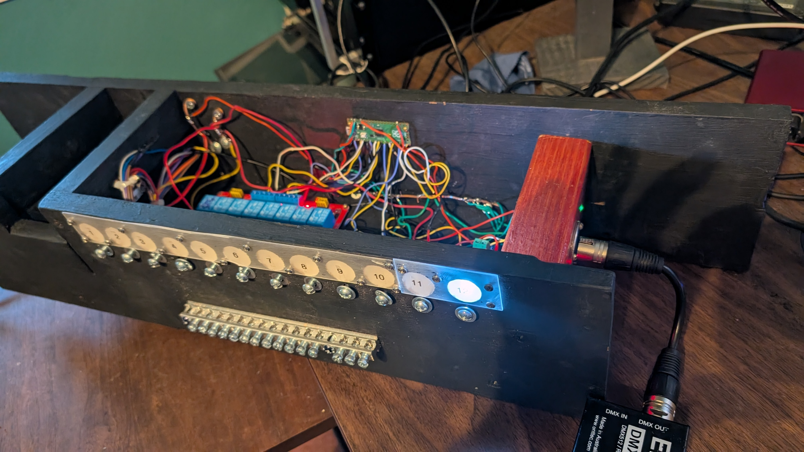
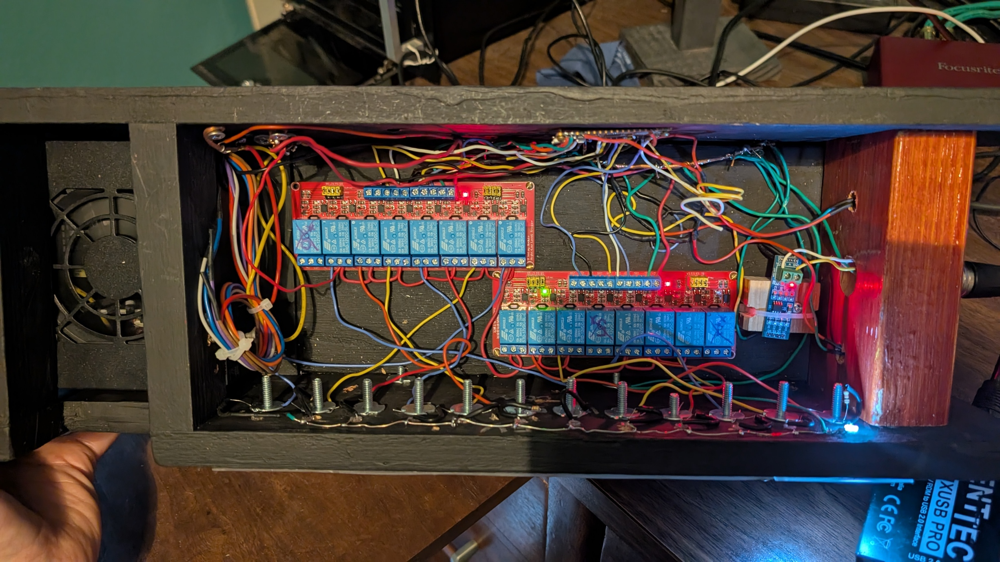
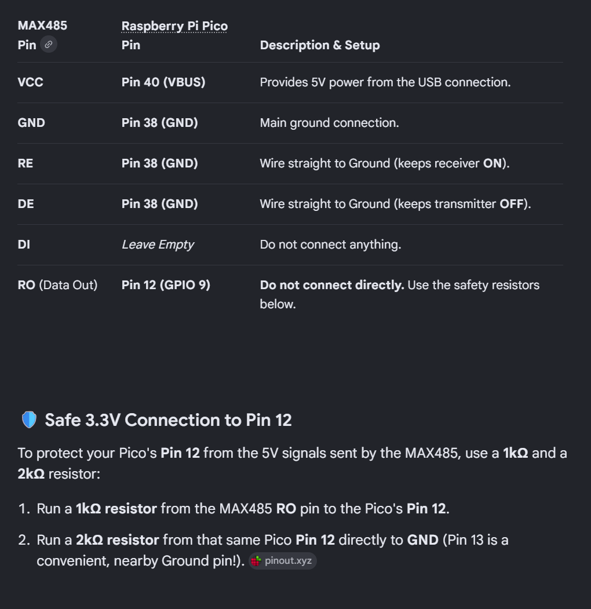

# Squib Box DMX 2

This is a theatrical Squib Box designed for the Heartstoppers Haunted house entry show in Racho Cordova California. It uses 12volt relays  to open pneumatic valves that would be loaded with flour to imitate a built hitting a wall.

## Hardware





The controller uses:

- An original Raspberry Pi Pico (RP2040)
- A MAX485-compatible RS-485 receiver module
- A standard DMX512 controller or lighting desk
- Relay modules or suitable driver circuitry for the external 12 V loads

The Pico GPIO pins must not drive 12 V relay coils directly. Use relay modules
or transistor/MOSFET drivers with flyback protection, and connect grounds as
required by the chosen driver circuit.

### MAX485 Receive-Only Wiring

This project only receives DMX. The MAX485 transmitter is disabled and its
driver input is unused.

| MAX485 | Raspberry Pi Pico | Purpose |
| --- | --- | --- |
| VCC | VBUS, physical pin 40 | 5 V module power from USB |
| GND | GND | Common ground |
| RE | GND | Keep the receiver enabled |
| DE | GND | Keep the transmitter disabled |
| DI | Not connected | Transmit data is not used |
| RO | GPIO 5, physical pin 7, through divider below | DMX receive data |
| A/B | DMX data pair, XLR pins 3/2 | Differential DMX input |

> **Important:** Confirm the voltage requirements and pin labels for your exact
> MAX485-compatible module. A module powered from 5 V can produce a 5 V `RO`
> signal, which must not be connected directly to a Pico GPIO.

For a 5 V `RO` signal, use a resistor divider:

1. Connect a 1 kOhm resistor between MAX485 `RO` and Pico `GPIO 5` (physical pin 7).
2. Connect a 2 kOhm resistor between Pico `GPIO 5` and `GND`.

This reduces the receiver output to approximately 3.3 V for the Pico input.
If DMX activity is not detected, verify the common ground and swap the A/B data
wires; A/B labels are not consistent across all RS-485 modules.



> **Diagram correction for this project:** The legacy diagram labels the data
> connection as Pico physical pin 12 (`GPIO 9`). Do not use that signal pin with
> this firmware. Connect the divided `RO` signal to physical pin 7 (`GPIO 5`),
> which is the DMX input compiled into this project.

Pico SDK C++ rewrite of the Squib-Box MicroPython controller for the original
Raspberry Pi Pico (RP2040). DMX framing is detected by a PIO state machine and
received with DMA, so channel alignment does not depend on UART polling timing.

## Why This Replaces the Python Version

This is the production replacement for the original MicroPython firmware. It
keeps the same 12-channel control purpose, but moves the timing-sensitive DMX
input and output control into compiled Pico SDK C++ firmware.

The replacement was made for more predictable operation on the RP2040:

- PIO detects DMX framing in hardware instead of relying on interpreter-driven UART polling.
- DMA transfers each frame into memory without making the main loop read every incoming byte at exactly the right time.
- Two-frame confirmation and a deadband reject brief or borderline DMX value changes before an output is triggered.
- Pulses are queued and timed independently, preventing simultaneous requests from disrupting pulse duration.
- Outputs are set LOW immediately at startup and remain LOW if DMX input cannot be initialized.
- The controller boots directly into a standalone compiled firmware image and does not require a MicroPython runtime or Python files on the Pico.

The Python version should be treated as legacy. New fixes and deployment should
use the UF2 produced by this project.

## Behavior

- DMX input: GPIO 5 through a MAX485 receiver
- DMX channels 1-11: rising-edge 150 ms pulses
- DMX channel 12: GPIO 13 stays HIGH while active
- ON confirmation: value 110 or higher for two frames
- OFF confirmation: value 90 or lower for two frames
- Deadband 91-109 preserves the current channel state
- Pulse outputs are queued and run sequentially
- DMX activity LED: GPIO 0, dim PWM blink while frames are arriving
- Power LED: GPIO 18, dim steady PWM
- All controlled outputs start LOW
- Production firmware has USB/UART console output disabled

## Channel Map

| DMX | GPIO | Behavior |
| ---: | ---: | --- |
| 1 | 1 | 150 ms pulse |
| 2 | 2 | 150 ms pulse |
| 3 | 3 | 150 ms pulse |
| 4 | 4 | 150 ms pulse |
| 5 | 6 | 150 ms pulse |
| 6 | 7 | 150 ms pulse |
| 7 | 8 | 150 ms pulse |
| 8 | 9 | 150 ms pulse |
| 9 | 10 | 150 ms pulse |
| 10 | 11 | 150 ms pulse |
| 11 | 12 | 150 ms pulse |
| 12 | 13 | Maintained HIGH/LOW |

## Build

Run `build.cmd`, or press `Ctrl+Shift+B` in VS Code and select
`Build Squib Box DMX 2 UF2`.

The firmware is produced at:

```text
build\squib_box_dmx_2.uf2
```

Flash with all effects disconnected. Hold BOOTSEL while connecting the Pico,
then copy the UF2 to the `RPI-RP2` drive. Verify every channel mapping and power
cycle repeatedly before connecting effects.

The build uses the existing SDK at `C:\repos\Pico-Examples\pico-sdk` and the
installed ARM GNU and Visual Studio CMake/Ninja tools. It does not access or
modify BloodSquib during the build.
